[팀 버너스리](https://namu.wiki/w/팀%20버너스리)가 고안한 [웹](https://namu.wiki/w/월드%20와이드%20웹?from=웹)이 등장한 이래로 많은 웹 서비스 기술들이 생기고 사라졌습니다. 하지만 여전히 [HTML](https://namu.wiki/w/HTML)은 우리에게 중요한 기술로 남아 있습니다. 또한 CSS 역시 웹 문서의 스타일을 꾸미기 위해 사용하는 강력한 기술입니다. 웹 개발자라면 HTML과 CSS로 이루어진 웹 문서에 대한 이해가 필수적일 것입니다. React, Vue 등 많은 프론트엔드 기술이 있지만 이것들 역시 더 효과적이고 매력적인 웹 문서(또는 웹 페이지)를 만들기 위한 도구일 뿐입니다.

저 역시 프론트엔드 개발에서 React를 주로 사용하지만 HTML과 CSS, Javascript를 이용한 가장 기본적인 부분을 알아야 할 필요를 느낄 때가 많습니다. React를 사용하더라도 CSS를 적용하는 방법은 다양합니다. 그 중 저는 [MUI](https://mui.com), [Styled-components](https://styled-components.com) 등의 라이브러리를 사용하면서 CSS-in-JS를 주로 다루었습니다. 자바스크립트를 통해 동적인 CSS를 생성할 수 있는 **CSS-in-JS**는 어떤 방식으로 CSS를 적용할까요?

> 이번 예시 코드는 `React`에서 동작하는 `CSS-in-JS`를 살펴봅니다. 하지만 핵심 원리가 `React`에 의존하지는 않습니다.

## 1. CSS-in-JS

> Cascading Style Sheets (CSS) is a stylesheet language used to describe the presentation of a document written in HTML or XML. ([MDN](https://developer.mozilla.org/en-US/docs/Web/CSS))

CSS는 스타일 시트 언어입니다. 프로그래밍 언어가 아니기에 정적으로 동작합니다. 그래서 순수 CSS를 이용하여 복잡한 웹 페이지의 모든 스타일을 적용하고 관리하기란 꽤나 귀찮은 일이 아닐 수 없습니다. 그런 CSS를 보완하기 위해 여러 기술이 생겨났습니다. Sass, Less, Stylus 등의 CSS 전처리기 방식과 JSS, styled-components, emotion 등의 CSS-in-JS 방식 등이 있습니다.

CSS-in-JS 방식은 말 그대로 자바스크립트로 작성한 CSS입니다. JS를 통해 생성되기 때문에 runtime에서 시트가 생성, 관리되며 프로그래밍 언어의 동적 특징을 이용할 수 있습니다. 또한 몇몇 라이브러리는 Sass 등의 중첩 CSS 문법을 사용할 수도 있습니다.

???
???
???

## 2. CSSOM, CSSStyleSheet

인기 있는 CSS-in-JS 라이브러리 중 `react-jss`, `styled-components`, `@emotion/css`을 이용해 코드를 작성해보고 CSS가 어떻게 생성되는 지 직접 알아보겠습니다. 저는 `CRA`를 이용하여 리액트 환경을 구성하고 간단한 Task 관리 앱을 만들었습니다. 화면 결과는 따로 보여드리지 않고 생성된 `html` 태그와 `CSSOM` 객체에 정의된 스타일 시트를 확인하여 CSS가 어떻게 적용되는지 확인해보겠습니다.

```jsx
// src/App.jsx
import { useState } from "react";

import Task from "./Task";

function App() {
  const [tasks, setTasks] = useState([
    { id: 1, title: "대청소", done: false },
    { id: 2, title: "설거지", done: false },
    { id: 3, title: "빨래", done: false },
    { id: 4, title: "가출", done: false },
  ]);

  const handleDoneChange = (task) => () => {
    task.done = !task.done;
    setTasks([...tasks]);
  };

  console.log(document.styleSheets); // CSSOM 객체에 정의된 cssRule 확인
  return (
    <div>
      <h1>TASKER</h1>
      <hr />
      <ul>
        {tasks.map((task) => (
          <Task
            key={task.id}
            title={task.title}
            done={task.done}
            onDoneChange={handleDoneChange(task)}
          />
        ))}
      </ul>
    </div>
  );
}

export default App;
```

위에서 언급한 라이브러리를 이용하여 `Task` 컴포넌트를 작성하겠습니다. 먼저 `react-jss`의 `createUseStyles`를 이용합니다.

```jsx
// src/Task.jsx
import { createUseStyles } from "react-jss";

const useStyles = createUseStyles(() => ({
  root: {
    width: 500,
    display: "inline-block",
  },
  rootChecked: {
    color: "grey",
    textDecoration: "line-through",
  },
}));

const Task = (props) => {
  const cls = useStyles(props);
  const { title, done, onDoneChange } = props;
  return (
    // 완료 여부에 따라 조건부 클래스 적용
    <li className={[cls.root, done ? cls.rootChecked : ""].join(" ")}>
      <input type="checkbox" checked={done} onChange={onDoneChange} />
      {title}
    </li>
  );
};

export default Task;
```

`createUseStyles`를 이용하면 객체 형식으로 CSS를 작성합니다. 객체 속성 하나가 하나의 선택자로 매핑됩니다. 브라우저 개발자도구에서 `html`을 열어보면 `head` 태그 안에 `style` 태그가 생성된 것을 확인할 수 있습니다.

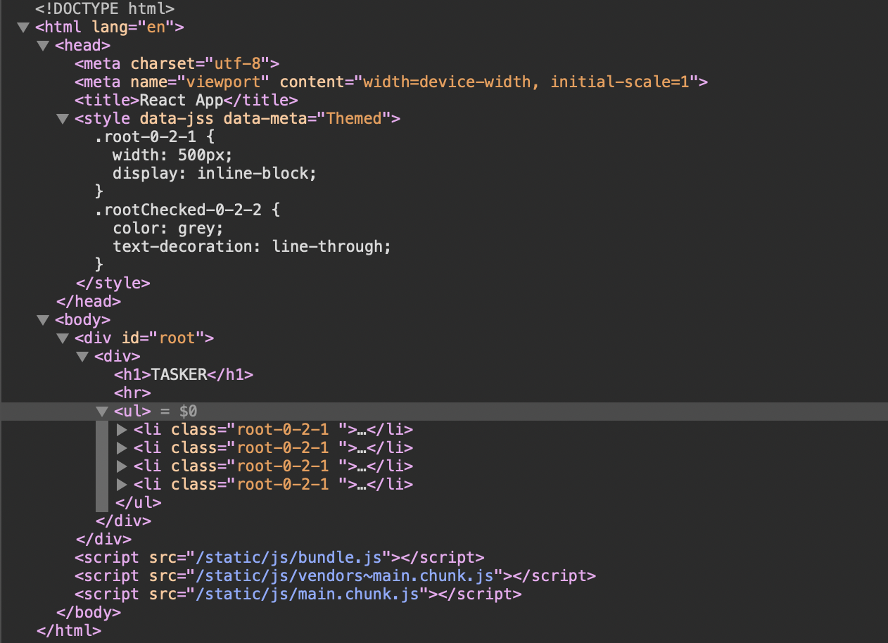

`console.log(document.styleSheets)` 코드에서 출력된 객체를 살펴보면 `1`개의 `CSSStyleSheet`가 생성되어 있습니다. `cssRules` 속성을 살펴보면 아래와 같이 `2`개의 `CSSStyleRule`이 생성되었습니다. 위 `style` 태그에서 생성된 각각의 선택자에 대한 스타일 룰이 이렇게 생성되어 있는 것입니다.

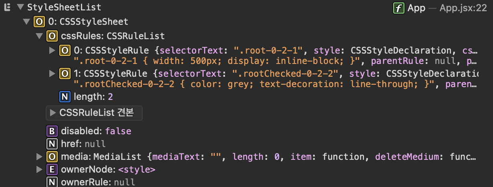

여기에서 `Task`의 체크박스를 클릭하여 조건부 스타일이 적용되도록 해보겠습니다.

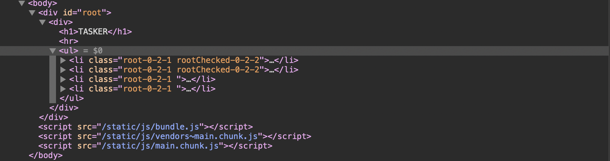

변경된 결과를 보면 이미 스타일은 생성되어 있고, `Element`에 `class`만 추가되어져서 스타일이 적용되는 방식입니다. 이 과정에서 `style` 태그의 내용이나 `CSSStyleSheet`의 변경은 없었습니다.

## 3. Props 기반 스타일 적용(react-jss)

위의 예제에서는 `done`의 값을 통해 클래스명을 추가하여서 스타일을 적용하는 방식을 이용했습니다. 이 방식은 미리 **스타일 시트**를 작성해두고, 조건적으로 적용할 것에 대해서만 결정할 수 있습니다.

이번에는 이와 다르게 `CSS-in-JS`의 대부분 라이브러리가 제공하는 `props`를 기반으로 스타일을 생성하는 방식으로 구현해보겠습니다. 위의 예제에서 `useStyles` 함수의 구현을 수정합니다.

```jsx
const useStyles = createUseStyles(() => ({
  root: (props) => ({
    width: 500,
    display: "inline-block",
    color: props.done ? "gray" : "inherit",
    textDecoration: props.done ? "line-through" : "inherit",
  }),
}));

const Task = (props) => {
  const cls = useStyles(props);
  const { title, done, onDoneChange } = props;
  return (
    <li className={cls.root}>
      <input type="checkbox" checked={done} onChange={onDoneChange} />
      {title}
    </li>
  );
};
```

`useStyles`의 인자로 넘겨준 `props`를 스타일 시트 객체에서 함수의 파라미터로 가져와 참조할 수 있습니다. 이 방식으로 변경하면 `html` 태그와 `CSSStyleSheet`는 어떻게 다를까요?

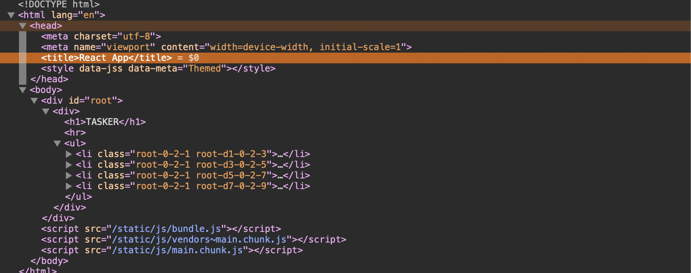

이전과는 다르게 `style` 태그에 `css`는 작성되어 있지 않습니다. 그리고 `Task` 컴포넌트에서 각 항목의 클래스를 다르게 주입하는 것을 볼 수 있습니다. 지금 예제에서는 `root-0-2-1`과 `root-d?-0-2-?`처럼 두 개씩 주입되어 있고 그 중 하나는 각각 다른 클래스가 입력되어 있습니다.

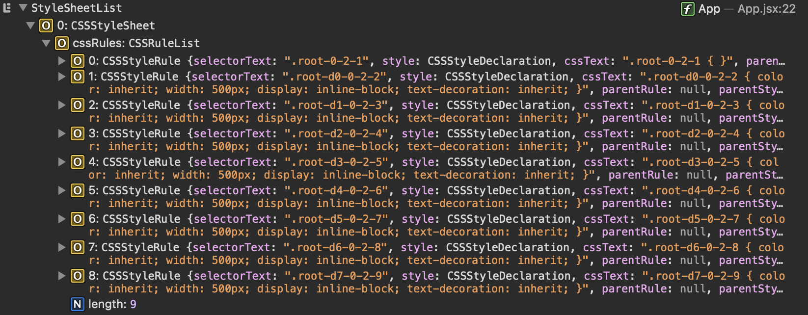

`CSSStyleSheet`를 확인해보면 각 항목마다 다르게 주입된 클래스별로 `CSSStyleRule`이 생성되어 있는 것을 확인할 수 있습니다.

이 상태에서 체크박스를 클릭하여 `props`를 이용한 조건부 스타일을 적용해보겠습니다.

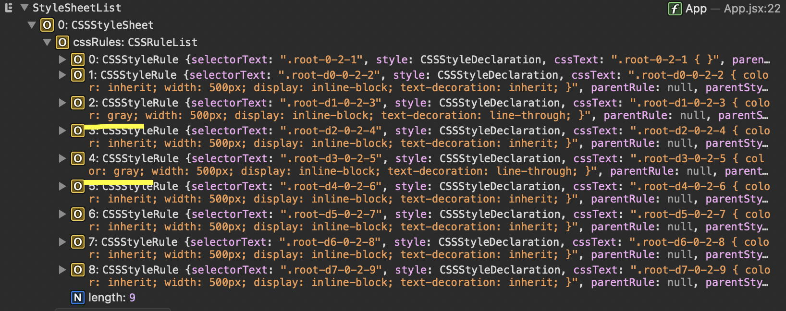

`li`태그의 클래스는 변경된 것이 없고, `props.done`으로 지정된 컴포넌트는 `CSSStyleRule`이 변경되었습니다.

위 예제를 통해 확인할 수 있는 것은 `react-jss`의 경우 `props`에 의한 동적 스타일링을 할 때, 각 항목마다 다른 `class`와 `CSSStyleRule`를 생성하여 적용한다는 것입니다.

## styled-components

이번에는 `styled-components`를 사용하여 같은 예제를 만들어 봅시다. `styled-components`는 `html` 태그에 `css`를 결합하여 리액트 컴포넌트로 만들어 사용합니다. `css`를 작성하기 위해서 [Tagged templates](https://developer.mozilla.org/en-US/docs/Web/JavaScript/Reference/Template_literals#tagged_templates) 문법을 사용할 수 있습니다. 만들어진 리액트 컴포넌트의 `props`를 이용해 동적인 스타일을 적용할 수 있습니다.

`Task` 컴포넌트를 아래와 같이 수정하겠습니다.

```jsx
import styled from "styled-components";

const ListItem = styled.li`
  width: 500px;
  display: inline-block;
  color: ${({ done }) => (done ? "gray" : "inherit")};
  text-decoration: ${({ done }) => (done ? "line-through" : "inherit")};
`;

const Task = (props) => {
  const { title, done, onDoneChange } = props;
  return (
    <ListItem done={done}>
      <input type="checkbox" checked={done} onChange={onDoneChange} />
      {title}
    </ListItem>
  );
};

export default Task;
```

`html` 태그와 `CSSStyleSheet`를 살펴보겠습니다.

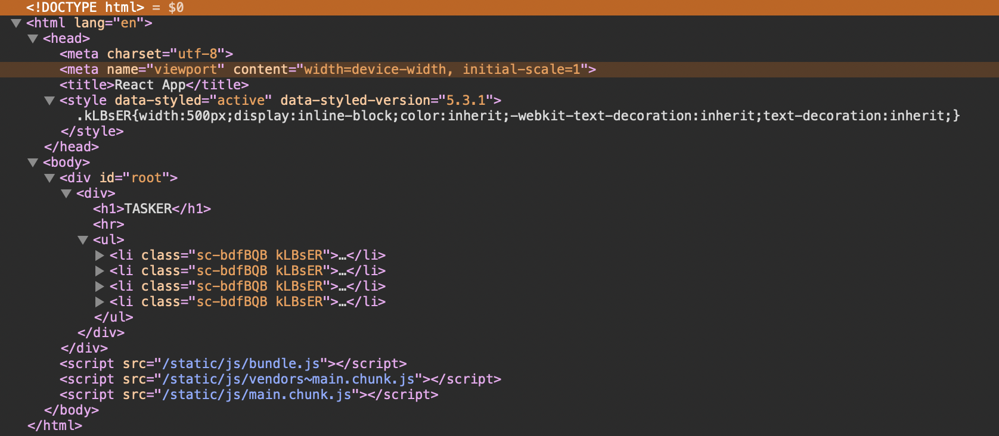

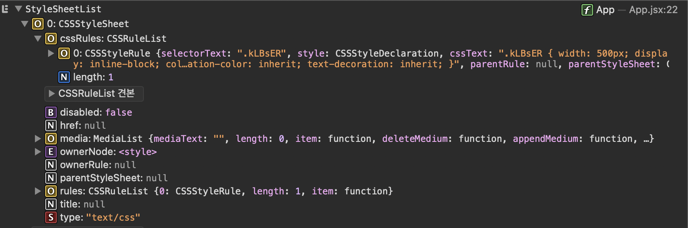

`react-jss`에서의 첫 결과와 비슷하게, 하나의 `CSSStyleRule`이 생성되고 그것이 각 `li` 태그에 동일하게 적용되어 있습니다. 이제 체크박스를 클릭해 조건부 스타일을 적용해보겠습니다.

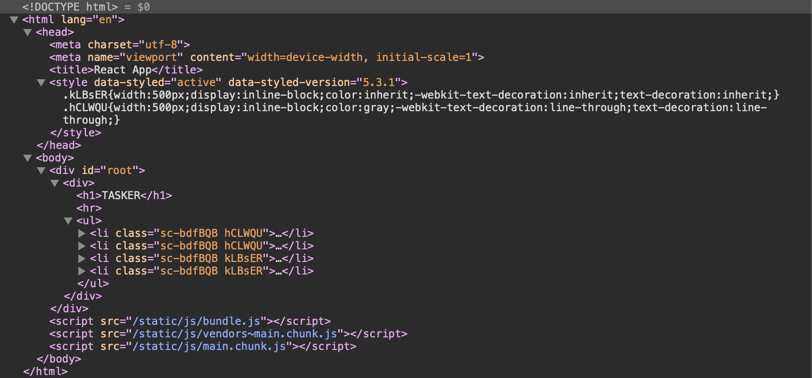

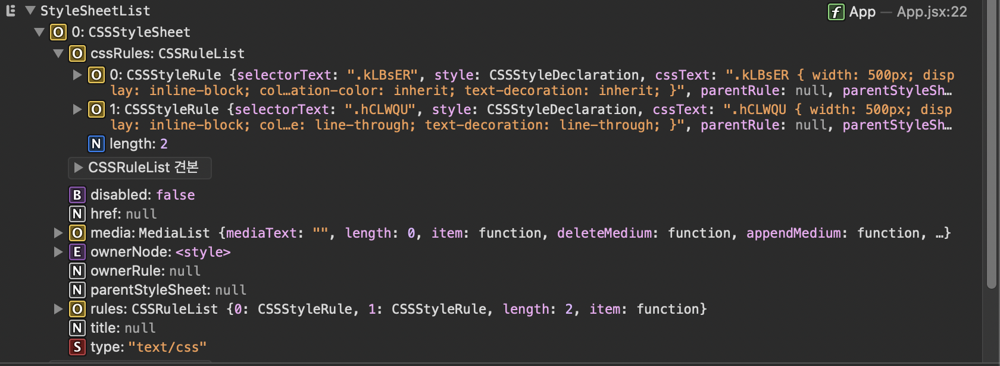

`html`에서의 변경은 `css`가 생성되고 `li` 태그의 클래스가 변경되었습니다. `CSSStyleSheet`의 변경은 `CSSStyleRule`이 추가로 생성되었습니다.

이 예제를 통해 확인할 수 있는 것은 `styled-components`는 필요한 `css`를 생성해서 사용하고, `props`에 의한 동적인 스타일에서는 런타임에서 `css`(`CSSStyleRule`)을 생성하여 사용한다는 것을 알 수 있습니다. `props.done` 값 하나만 사용할 때는 `2`개의 `CSSStyleRule`이 생성되었지만 만약 다른 `props`를 이용한다면 더 많은 `CSSStyleRule`이 생성될 것입니다.

## @emotion/css

이번에는 `@emotion/css`를 이용하여 같은 실험을 해보겠습니다. `Task` 컴포넌트를 아래와 같이 수정합니다.

```jsx
import { css } from "@emotion/css";

const Task = (props) => {
  const { title, done, onDoneChange } = props;
  return (
    <div
      className={css`
        width: 500px;
        display: inline-block;
        color: ${done ? "gray" : "inherit"};
        text-decoration: ${done ? "line-through" : "inherit"};
      `}
    >
      <input type="checkbox" checked={done} onChange={onDoneChange} />
      {title}
    </div>
  );
};

export default Task;
```

`html`과 `CSSStyleSheet`를 봅시다.

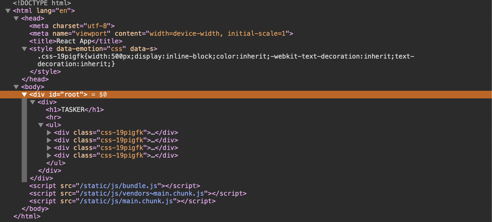

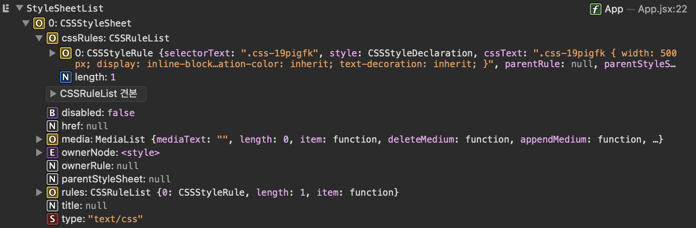

이전 라이브러리와 다르지 않은 결과입니다. 바로 체크박스를 클릭해 동적인 스타일을 적용해 보겠습니다.

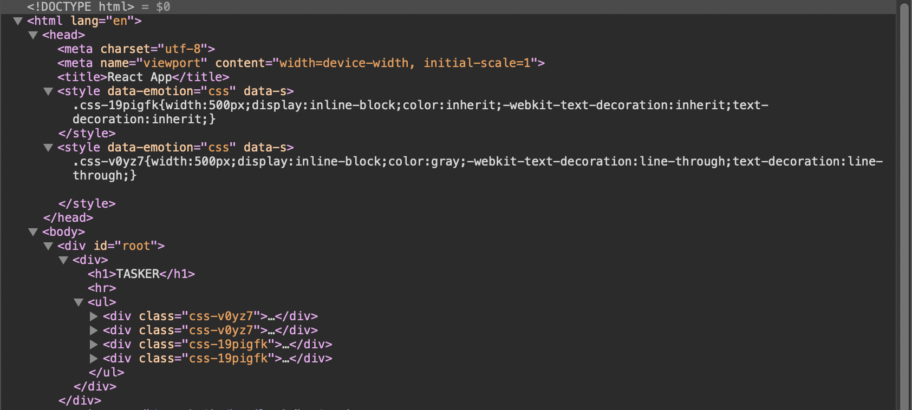

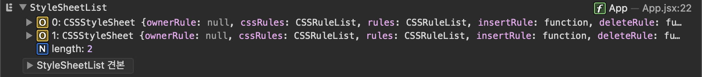

`html`의 결과를 살펴보면 다른 라이브러리와는 다르게 `style`태그가 `2`개가 되었습니다. 또한 `CSSStyleRule`이 추가된 것이 아닌 `CSSStyleSheet`가 추가된 것을 볼 수 있습니다.

## 마무리

CSS-in-JS의 여러 라이브러리를 직접 사용해보면서 어떤 방식으로 `css`를 적용하는 지 살펴보았습니다. 라이브러리들의 내부적인 상세한 구현은 모르지만 `cssom`을 조작하여 스타일을 적용한다는 것을 예제를 통해 확인할 수 있었습니다. 또한 흥미로웠던 것은 라이브러리마다 `cssom`을 조작하는 방식이 다르다는 것입니다. `CSSStyleRule`이 **생성**되는 방식과 **변경**되는 방식 중에서 상황에 따라 적합한 방식을 선택하는 것도 생각해볼 만한 구현 디테일인 것 같습니다.

개인적으로 최근 [MUIv5](https://mui.com)가 발표되면서 `CSS-in-JS` 엔진에 대한 이야기([Migration from JSS to emotion](https://mui.com/blog/mui-core-v5/#migration-from-jss-to-emotion))를 인상 깊게 읽었었는데, 이번에 더 흥미가 생기게 된 것 같습니다.
