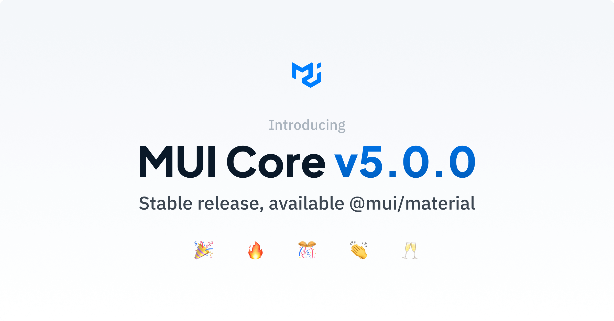

> 원문: [Introducing MUI Core v5.0](https://mui.com/blog/mui-core-v5/) \
> \
> 이 글은 **원문**의 개선점에 대한 내용의 일부를 리뷰한 글이며, 오역이 있을 수도 있습니다.

[MUIv5](https://mui.com)가 릴리즈 되었습니다. MUI는 구글의 디자인 철학인 [Material Design](https://material.io)을 구현한 자바스크립트 라이브러리이고, [리액트 UI 라이브러리](https://www.npmtrends.com/@material-ui/core-vs-antd-vs-react-bootstrap-vs-reactstrap-vs-semantic-ui-react) 중에서 가장 점유율이 높은 패키지입니다. 여전히 활발하게 업데이트가 진행 중인 MUI팀의 고민들을 살펴보면서 그들이 프로덕트 품질 향상과 팀 성장을 이루어가는 경험을 살펴보겠습니다.

## 1. 브랜딩 관점에서 본 MUI

> We hope you are going to enjoy the DX improvement of only having to type 3 letters to type to find us on the internet: mui.com and to import us from npm @mui!

이전에는 **Material-UI**였으나 이제 단 **3글자**로 줄였습니다. **개발자 경험**(**DX**)의 개선을 위해서라고 하는데, 얼마나 DX에 관심이 많은지 알 수 있는 부분입니다. 이번 업데이트에서 패키지 이름이 변경되는 것은 단순히 다른 이름을 `import`하는 [Breaking Changes](https://stackoverflow.com/questions/21703216/what-is-a-breaking-change-in-software)이면서도 브랜딩 관점에서 네이밍을 명확히 하는 변경입니다.

1. Material-UI 조직을 `MUI`라 칭함.
2. Material-UI MIT 컴포넌트 셋을 `MUI Core`라 칭함.
3. Material-UI X 고급 컴포넌트 셋을 `MUI X`라 칭함. _(유료 플랜)_

**MUI**와 **MUI Core**로 이름을 구분하는 것은 라이브러리 자체와 개발 그룹을 구분하는 것이 의미있다는 것을 말합니다. UI 라이브러리인 MUI의 관심사는 **사용자의 경험(UX)**과 그것을 만들어내는 **개발자의 경험(DX)**이라는 것을 알 수 있습니다. 이 두가지는 이렇게 바꾸어 표현할 수도 있을 것 같습니다. 하나는 MUI를 사용하는 개발자들의 경험(UX)이고, 또 하나는 MUI를 커스텀하며 생산하는 개발자들의 Contribute 경험(DX)입니다._(직접 라이브러리에 컨트리뷰터로 참여하지 않더라도 각자의 프로젝트에서 커스텀하여 사용하는 것을 말함)_

> 네이밍을 비롯한 MUI의 브랜딩 포인트는 [이 포스트](https://mui.com/blog/material-ui-is-now-mui/)에서 자세히 보실 수 있습니다.

## 2. Improved customizability

### 2.1. JSS에서 Emotion으로

MUI는 지난 7년 동안 여러 스타일링 솔루션을 거치며 변경을 반복했었습니다. 지난 버전에서 사용된 [JSS](https://cssinjs.org/)를 이용한 스타일링 방식은 React Hooks와 조합해 사용하기 편했고, 재사용과 오버라이딩하기 좋은 방식입니다. 그리고 이번 업데이트에서 [emotion](https://emotion.sh/)을 이용한 스타일링 방식으로 변경되었습니다. 이에 대해 다음 세 가지의 문제를 고려했습니다.

1. 리액트 커뮤니티에서 `styled()`가 가장 인기 있는 CSS-in-JS API로 자리 잡았습니다.

   styled-components, emotion, goober, stitches, linaria에서 이 방식을 사용합니다. MUI는 여러 스타일 라이브러리와 조합하여 사용할 수 있지만, 개발자들은 여전히 `makeStyles` API와 같은 새로운 것을 알아야 할 필요를 느낍니다. _(v4에서는 대부분의 컴포넌트 [예제](https://v4.mui.com/components/buttons/)가 `makeStyles` API로 작성되어 있습니다.)_

2. React와 JSS의 통합은 우리가 목표하는 커스터마이징 DX의 그다음 단계를 해결하기엔 너무 느립니다. MUI v4에서의 정적 CSS 생성은 빨랐습니다. 심지어 emotion보다 빨랐습니다. 하지만 동적 스타일 생성은 너무 느려서 재구현할 필요가 있었습니다.

3. 많은 개발자가 styled-components로 마이그레이션할 것을 지지했고, 우리가 유지 보수하는 custom React JSS Wrapper를 삭제할 수 있었습니다. 경험으로 볼 때, 커스텀 스타일링 솔루션을 유지 보수하는 데에는 상당한 시간이 소요됩니다.

`makeStyles` API(createUseStyles의 확장)를 사용해본 경험으로는 크게 불편하다고 느끼지도 못했고, 재사용과 확장성이 좋은 방식이었습니다. 하지만 `2`에서 말하는 동적 스타일을 생성하는 부분은 다른 스타일링 API와 비교히면 성능적인 아쉬움이 있었습니다. 그러한 점에서 많은 개발자가 선호하는 `styled()` API를 고려하는 것은 반가운 소식입니다.

또한 MUI를 사용하는 저도 역시 프로젝트에 맞는 커스텀 설정을 구성하여 사용합니다. MUI팀 역시 Reac JSS를 래핑하는 커스텀 설정을 유지 보수하는 것이 비용과 경험적인 면에서 얼마나 비효율적인지를 말해주고 있습니다.

MUI팀은 여러 옵션을 조사한 후, 위의 이슈를 해결하는 가장 좋은 해결책이라고 생각하는 것을 결정했습니다.

1. 스타일을 추가하는 가장 저수준의 기본적인 요소인 `styled()`를 만들었습니다. 이 API는 이미 잘 알려져 있습니다.

2. 공통 인터페이스와 구체적인 구현을 정의했습니다.

   - `@mui/styled-engine`: emotion으로 구현 (default)
   - `@mui/styled-engine-sc`: styled-components로 구현
   - 다른 스타일 라이브러리를 사용하신다면, 자유롭게 래퍼를 제공하세요.

   개발자는 다른 스타일 엔진 사이에서 변경할 수 있습니다. styled-components를 사용하면 더 이상 emotion과 styled-components를 모두 번들링할 필요가 없습니다. 또한, 각각에 대한 서버 사이드 렌더링 설정을 구성할 필요도 없습니다.

   공통 인터페이스를 정의함으로 인해 MUI 컴포넌트 스타일링에서도 관심사의 분리가 이루어졌습니다. 실제 스타일링 하는 구현부에서는 어떤 엔진을 사용하는지 구현에 대해 직접 의존할 필요가 없고, 스타일 엔진에 대한 추상화가 이루어졌습니다.

3. MUI팀은 emotion에 지난 몇 달 동안 월 $100을 후원했습니다. 이것을 지금은 $1000으로 인상했습니다. emotion 라이브러리가 기술적 수준을 이끌어가면서 한계를 초월하도록 돕는 것이 가장 큰 관심사이기 때문입니다.

emotion으로 변경에 대한 첫 번째 즉각적인 이점은 **성능**입니다. `<Box>` 컴포넌트는 v4와 비교했을 때 v5에서 [5배~10배](https://codesandbox.io/s/zlh5w?file=/src/App.js) 정도 성능이 좋습니다.

### 2.2. `sx` 속성

기존에 있었던 `MUI System`인 `<Box>` 컴포넌트를 통해 해결하려고 했던 문제들이 있습니다.

1. **컨텍스트 스위칭**으로 낭비되는 시간. styled API를 사용하면 컴포넌트를 스타링일(선언)하는 부분과 사용하는 부분 사이를 왔다 갔다 해야합니다. 스타일에 대한 코드를 필요한 곳에 바로 작성할 수는 없을까요?

2. **네이밍**이 어렵다. 컴포넌트의 좋은 이름을 짓기 위해 혼자서 분투해본 적이 있을겁니다. 이름을 새로 지을 필요를 제거할 수는 없을까요?

3. UI에 대해 **일관성을 지키기**는 어렵다. 팀에서 여러 사람이 함께 개발할 때, 팀 구성원들 간 협의해야할 사항이 있기 때문입니다.

v5에서 새롭게 추가된 `sx` 속성은 기존 `MUI System`을 한 단계 더 발전시켰습니다. 이 속성은 모든 컴포넌트에서 사용할 수 있고, CSS API의 수퍼셋인 CSS 속성, 약칭, 미디어 쿼리 헬퍼 등을 노출합니다.

```jsx
// add margin: 8px 0px;
// by Box
<Box m={1}>
  <Slider />
</Box>

// by sx prop
<Slider sx={{ my: 1 }} />
```

`<Box>` 컴포넌트는 꽤 훌륭한 솔루션이었습니다. 하지만 여전히 아쉬운 점이 있습니다. 위의 문제들을 해결하긴 해도 그것 때문에 `<Box>` 컴포넌트를 추가해야 하는 경우도 있기 때문입니다. `sx` 속성이 더 편리한 솔루션으로 자리잡을지, 작성해야할 하나의 방식만 늘어나는 것은 아닌지 우려되기도 합니다. 어쨌든 새로운 시도는 늘 환영입니다.

> `sx` prop과 함께 개선된 MUI System에 대한 내용은 [이 포스트](https://mui.com/system/basics/#why-use-the-system)에서 자세히 보실 수 있습니다.

### 2.3. 동적 속성(Dynamic props)

리액트 컴포넌트는 조합으로 사용합니다. 개발자가 코어 컴포넌트를 확장하는 방법은 컴포넌트를 임포트하고, 확장하고, 래핑한 컴포넌트를 다시 익스포트하는 식으로 작성합니다. `label`과 `input`의 조합으로 이루어져 있는 `<TextField>` 컴포넌트가 대표적인 조합 예시라고 할 수 있습니다. v4까지 이런 방법으로 컴포넌트를 작성했지만 다음과 같은 문제가 있습니다.

1. 새 컴포넌트를 만들 때마다, 이것은 팀에게 추가되는 새로운 임포트 옵션입니다. 제대로 컴포넌트를 임포트 했는지 확인해야 합니다.

2. 새로운 `color="success"` 속성을 Button 컴포넌트에 추가하려면 사소하지 않은 CSS 커스텀이 필요합니다.

3. 보일러플레이트가 추가됩니다.

이러한 문제를 위해, v5에서는 컴포넌트의 고유한 동작을 확장하기 위한 기능이 제공됩니다. 이것은 Github에서 많은 투표를 받은 이슈 중 하나입니다([#13875](https://github.com/mui-org/material-ui/issues/13875)). 실제로 이 변경은 MUI Core 컴포넌트를 확장 가능한 플레이스홀더로 만듭니다.

이 기능의 첫번째로, 컴포넌트의 기존 스타일 매핑을 사용할 수 있습니다. 예를 들어, 새로운 `neutral` 색상을 컬러 팔레트에 추가하고, 버튼 컴포넌트는 그에 맞는 파생된 색상들을 계산합니다.

```tsx
import { createTheme, Button } from "@mui/material";

// 1. theme 객체 확장
const theme = createTheme({
  palette: {
    neutral: {
      main: "#d79b4a",
    },
  },
});

// 2. 팔레트에 새로운 색상에 대한 타입 정의
declare module "@mui/material/styles" {
  interface Palette {
    neutral: Palette["primary"];
  }
  interface PaletteOptions {
    neutral: PaletteOptions["primary"];
  }
}

// 3. Button 컴포넌트에 props로서 추가
declare module "@mui/material/Button" {
  interface ButtonPropsColorOverrides {
    neutral: true;
  }
}

// 4. 사용 이점
<Button color="neutral" />;
```

두번째로, theme 객체에 특정 `prop` 조합에 대한 CSS를 오버라이딩하는 커스텀 variant를 추가할 수 있습니다. 아래 코드에서는 variants로 `dashed`가 추가되었고, `dashed`와 `color="error"`의 조합에 대한 CSS를 커스텀으로 정의합니다.

```tsx
import { createTheme, Button } from "@mui/material";

// 1. theme 객체 확장
const theme = createTheme({
  components: {
    MuiButton: {
      variants: [
        {
          props: { variant: "dashed", color: "error" },
          style: {
            border: "1px dashed red",
            color: "red",
          },
        },
      ],
    },
  },
});

// 2. Button 컴포넌트에 props로서 추가
declare module "@mui/material/Button" {
  interface ButtonPropsVariantOverrides {
    dashed: true;
  }
}

// 3. 사용 이점
<Button variant="dashed" color="error">
  dashed
</Button>;
```

v4에서도 `theme` 객체를 확장하여 커스텀 색상이나 Mixins 등을 추가할 수 있었습니다. 하지만 MUI Core의 기본 컴포넌트에는 적용할 수 없었습니다. theme 객체에 추가 선언하는 것만으로도 컴포넌트 props로 자동 적용되는 것은 정말 MUI 사용자로서 반가운 업데이트입니다.

### 2.4. 글로벌 class 이름
